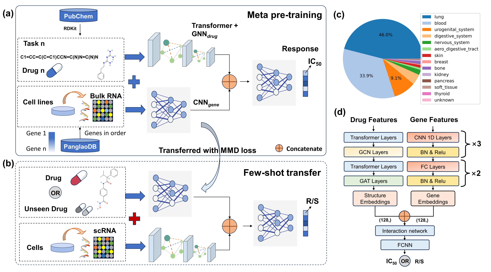

# SCREP
[](https://www.biorxiv.org/content/10.1101/2024.04.25.591050v2)
[](https://doi.org/10.1101/2024.04.25.591050)

Here, we introduce **SCREP**, aims to leverage extensive bulk knowledge in order to enhance the modeling of single-cell drug response prediction. To comprehensively extract the knowledge embedded in the compounds, we employ a graph-aware Transformer network to model the interrelations among atoms. Subsequently, we employ a position-based neural network to process genomic information organized in a specific sequence, thereby facilitating the extraction of rich contextual features.



**Note:** The sections on Datasets, Model, and Training below describe the contents of the respective directories. Due to size constraints and permissions, some data and ckpts may not be uploaded. The download url can be found in our paper.

## Datasets
### Gene name
The published Panglao dataset was downloaded from https://panglaodb.se/, please put the downloaded data under the path: data/panglao_10000.h5ad


### Single-cell datasets
Download origion single cell data and and the preprocessed `.pt` files from https://pan.baidu.com/s/1flg13UNGTmOuJDpwU_LjIw (code:SCRE):
GEO access     |Drug                          |Cell line       |Cancer type                  |No. Res  |No. Sens  | N.A.| Author       |   
GSE117872_HN120|Cisplatin                     |OSCC            |Oral squamous cell carcinomas|172      |346       |/    |Sharma, et al.|   
GSE117872_HN137|Cisplatin                     |OSCC            |Oral squamous cell carcinomas|150      |388       |/    |Sharma, et al.|
GSE149383      |Erlotinib                     |PC9             |Lung cancer                  |617      |849       |/    |Aissa, et al. |  
GSE110894      |I-BET-762                     |leukaemic cells |Acute myeloidleukemia        |670      |719       |/    |Bell, et al.  |  
GSE157220      |Gefitinib,Vorinostat,AR-42    |SCC47           |Head and Neck Cancer         |162      |162       |472  |Kinker et.al  |  
GSE157220      |NVP-TAE684,Afatinib,Sorafenib |JHU006          |Head and Neck Cancer         |81       |81        |259  |Kinker et.al  |  
GSE228154      |Afatinib                      |MDA-MB-468 cells|metastatic breast cancer     |665      |846       |/    |J. M. McFarland|  


### Pretrain data:
Download GDSC origion dataset from https://pan.baidu.com/share/init?surl=Z7xiX4TQyaXKydSceNhp0g (code:KDRU)

### Preprocessing GDSC data: 
run `preprocess_continue_IC50_ge16906_everydrug.py`, you will get data files in "data/processed": 
          data/processed/GDSC_norm_all_continueic50_gene16906_index.pt

### Preprocessing GDSC data into "sensitive" or "resistant": 
It is necessary to align the bulk data separately with the sensitive and resistant categories of the sc data. The IC50 should be filtered according to a 5% z-score, resulting in the following bulk data (sensitive: class 1, resistant: class 0):
          data/processed/GDSC_norm_allclass0_z_score_ic50_gene16906.pt  
          data/processed/GDSC_norm_allclass1_z_score_ic50_gene16906.pt

### Get indices of cell lines of specific tissue: 
run `drug_cell_list/tissue.py` and then run `drug_cell_list/drug_tissue_cell_index.py`:
          drug_cell_list/cell_tissue.json  
          drug_cell_list/tissue_type.json  
          drug_cell_list/all_drug_tissue_cell_index.json

## Model
`models`          
    - gat_gcn_transformer_ge_only_pretrain_meta.py - code of network
    
## Training
### Pretrain bulk model:
run `training_IC50_ge16906_fewshot_metatraining_2loss_onedrug.py`
- Based on the general GDSC pretrained model: `model_FeatureRelationNetwork_GDSC_norm_continue_ic50.model`, it is the model trained on all drug-cell lines dataset.

### Pretrain sc model:
run `training_IC50_ge16906_fewshot_metatraining_2loss_mmd.py`
- change parameters: "--dataset"，"--pretrained_path"，"--exp_name" to train sc model on different sc datasets.

*Thanks to [Thang Chu, et al.] for providing excellent code and documentation. This project was inspired by and includes some code from [GraTransDRP] T. Chu, T. T. Nguyen, B. D. Hai, Q. H. Nguyen and T. Nguyen, "Graph Transformer for Drug Response Prediction," in IEEE/ACM Transactions on Computational Biology and Bioinformatics, vol. 20, no. 2, pp. 1065-1072, 1 March-April 2023  
*Thanks to [Gabriela S Kinker, et al] for providing partial datasets [Gabriela S Kinker, et al. Pan-cancer
single-cell rna-seq identifies recurring programs of cellular heterogeneity. Nature genetics, 52(11):1208–1218, 2020]  
*Thanks to [Junyi Chen, et al.] for providing partial datasets[Chen, J., Wang, X., Ma, A., Wang, Q.E., Liu, B., Li, L., Xu, D. and Ma, Q., 2022. Deep transfer learning of cancer drug responses by integrating bulk and single-cell RNA-seq data. Nature Communications, 13(1), p.6494.]

### Tips:
Decreasing the args.updata_lr when the accuracy of meta training is retaining around 0.5 and dose not raise during the training phase of single cell transferring.

## References
```
[1]: Yang, W., Soares, J., et al.: Genomics of drug sensitivity in cancer (gdsc): a resource for therapeutic biomarker discovery in cancer cells. Nucleic acids research 41(D1), 955–961 (2012)
[2]: Barretina, J., Caponigro, G., et al.: The cancer cell line encyclopedia enables predictive modelling of anticancer drug sensitivity. Nature 483(7391), 603–607 (2012)
[3]: Ma, J., Fong, S.H., et al.: Few-shot learning creates predictive models of drug response that translate from high-throughput screens to individual patients. Nature Cancer 2(2), 233–244 (2021)
[4]: Shen, B., Feng, F., Li, K., Lin, P., Ma, L., Li, H.: A systematic assessment of deep learning methods for drug response prediction: from in vitro to clinical applications. Briefings in Bioinformatics 24(1), 605 (2023)
[5]: Ding, M.Q., Chen, L., et al: Precision oncology beyond targeted therapy: combining omics data with machine learning matches the majority of cancer cells to effective therapeutics. Molecular cancer research 16(2), 269–278 (2018)
```
## Citation
```
@article {Ge2024.04.25.591050,
	author = {Ge, Shuang and Sun, Shuqing and Ren, Yiming and Xu, Huan and Cheng, Qiang and Ren, Zhixiang},
	title = {SCREP: Towards Single-Cell Drug Response Prediction by Pharmacogenomic Embedding Enhanced Meta-Pretraining and Few-Shot Transfer Learning},
	elocation-id = {2024.04.25.591050},
	year = {2024},
	doi = {10.1101/2024.04.25.591050},
	publisher = {Cold Spring Harbor Laboratory},
	URL = {https://www.biorxiv.org/content/early/2024/10/21/2024.04.25.591050},
	eprint = {https://www.biorxiv.org/content/early/2024/10/21/2024.04.25.591050.full.pdf},
	journal = {bioRxiv}
}
```
